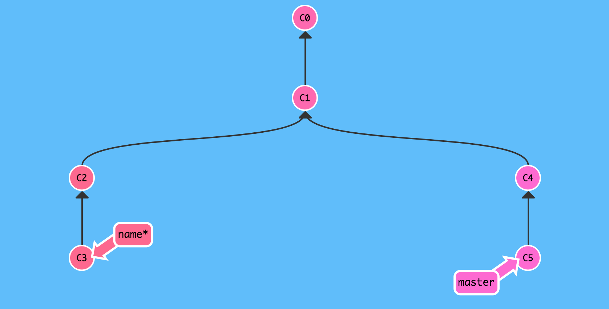
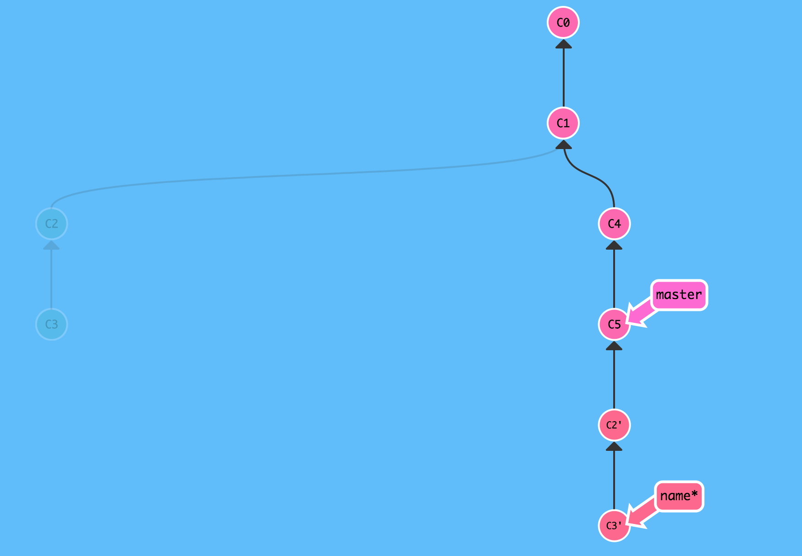
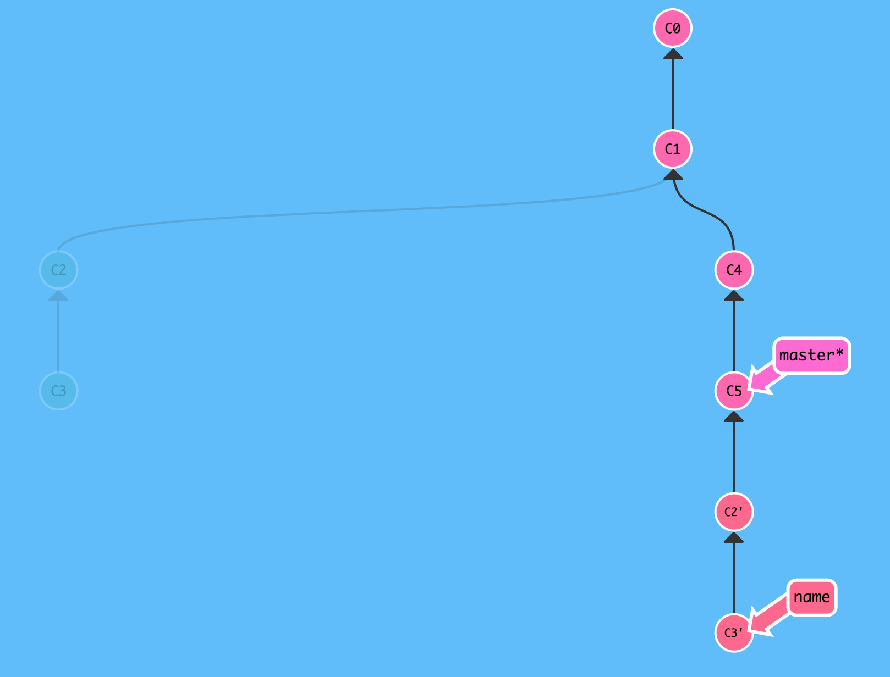
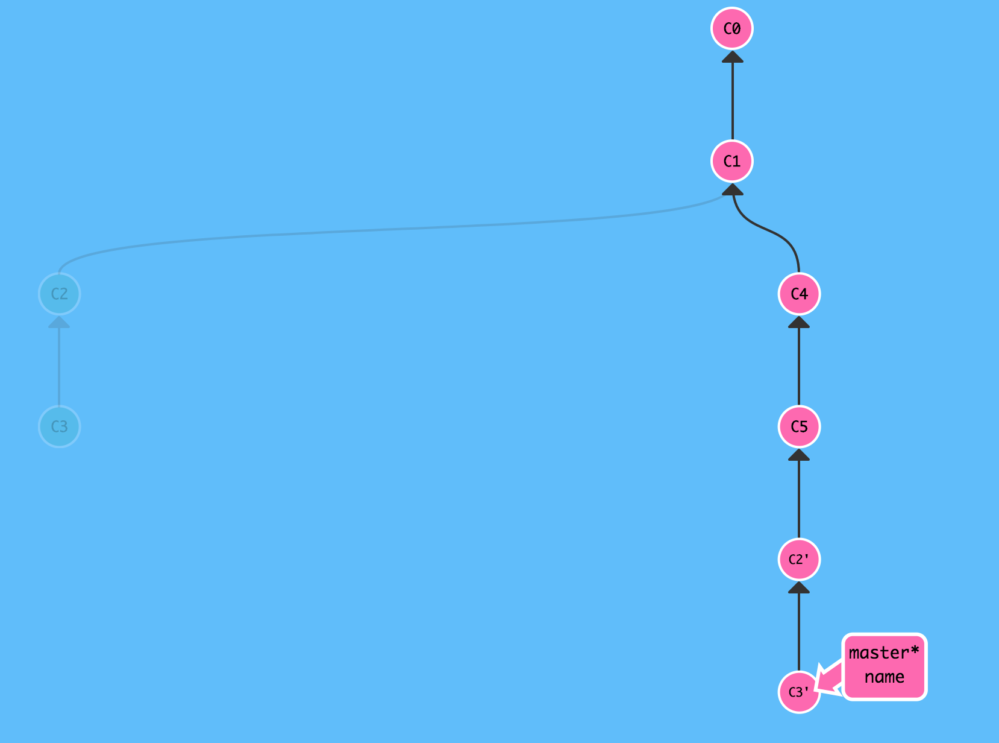

Git tutorial
====
This repo handles mainly Git but it also contains some good2know commands and the use of the terminal. Feel free to check it out and leave comments if you want to change something.

Content:
----
* [Git](#git)
  - [Start](#start)
    - [Git init](#git-init)
    - [Git status](#git-status)
    - [Git add](#git-add)
    - [Git commit](#git-commit)
    - [Git log](#git-log)
    - [Git branch](#git-branch)
    - [Git checkout](#git-checkout)
    - [Git remote](#git-remote)
    - [Git push](#git-push)
    - [Git fetch](#pull-and-fetch)
    - [Git pull](#pull-and-fetch)
  - [Workflow](#workflow)
* [Alias](#terminal)
* [Terminal](#terminal)
* [Vim](#vim)


Git:
-----
Stages:
1. Commited: </br>
_Saved in the git repository database_

2. Staged: </br>
_Not saved in the database, waiting to be commited_

3. Unstaged: </br>
_New files or files that have been edited but not staged_


Start:
-----
To start with Git you must first start a repository. This is done with the `git init` command in the folder you want to create a repository in.
</br> _Note: some things might look different because I use a theme in my terminal but the content should be the same._

```
➜ ~ mkdir testfolder

➜ ~ cd testfolder

➜ testfolder git init
Initialized empty Git repository in /Users/lindberg/testfolder/.git/

➜ testfolder git:(master)

```

Now you have a git repository to work with. To check that everything works correctly you could use the `git status` command.

```
➜ testfolder git:(master) git status
On branch master

No commits yet

nothing to commit (create/copy files and use "git add" to track)

➜ testfolder git:(master)
```

As you can see there are no commits yet. This means that there are no saved points in the repository. To create a commit (saved point) there must be something to commit, a change. I start by adding a file to my empty repository.

```
testfolder git:(master) touch newfile.txt

➜ testfolder git:(master?) git status
On branch master

No commits yet

Untracked files:
 (use "git add <file>..." to include in what will be committed)

 newfile.txt

nothing added to commit but untracked files present (use "git add" to track)
```

Now I have something to commit, first we must select what we want to commit and we do that with the `git add` command.

```
➜ testfolder git:(master?) git add newfile.txt

➜ testfolder git:(master+) git status
On branch master

No commits yet

Changes to be committed:
  (use "git rm --cached <file>..." to unstage)

	new file:   newfile.txt


➜ testfolder git:(master+)
```
Now you have _staged_ a file, this means it is ready to commit. To unstage (to unselect the file) you can use the command above `git rm --cached <filename>`

We want to commit so we use the `git commit` command.

This will open your terminal editor most likely _vim_ or _nano_ which are two terminal editors. This is what it looks like in Vim.

```
1
2 # Please enter the commit message for your changes. Lines starting
3 # with '#' will be ignored, and an empty message aborts the commit.
4 #
5 # On branch master
6 #
7 # Initial commit
8 #
9 # Changes to be committed:
10 #       new file:   newfile.txt
11 #
```

To start editing type `i` and to stop editing type `esc`. To quit vim type `:wq` to write and quit or just quit `:!q`. We will go over vim later but these are the navigation commands most people know and use.

Now you have commited (created a save point).

```
➜ testfolder git:(master+) git commit
[master (root-commit) c8b452a] Test commit
 1 file changed, 0 insertions(+), 0 deletions(-)
 create mode 100644 newfile.txt
```

To check previous commits you can check the log with the `git log` command.

```
commit c8b452acee6e408a0adc80356e7ac0fe3983230e (HEAD -> master)
Author: Adrian Lindberg <adrlin@student.chalmers.se>
Date:   Thu Jan 18 09:33:29 2018 +0100

    Test commit
(END)
```

To exit `git log` type `q`.

These are the most basic commands that you will use in your life.

Here is a summary of the commands:

#### Git init
`git init`
_Initializes a new git repository in the current folder_

_Creates a hidden `.git/` folder in the repo_

#### Git status
`git status`
_Used to check the status of the repository, see what files have been changed_

_add an alias for this, you will use it very often. I use '`gs`'._

#### Git Add
`git add <file(s)>`
_Add the following files to be staged_

`git add -A`
_Adds all edited files in the repository_

#### Git commit
`git commit -m 'Commit description goes here'`
_Saves the edits as a commit to the database, it is now possible to revert back to this position in time_

_'-m' = message_

`git commit -am 'Message'`
_Adds all files and commits_

`git commit -amend`
_Adds new files to last commit, allows you to change the last commit message_

`git commit --amend -m 'newmessagehere'`

`git commit —-amend —no-edit`
_Adds new changes to last commit without editing the commit message_

#### Git log
`git log`
_See all the commit history_


When you become more experienced you might want to start to look at the `git branch` command and the `git checkout` command. These two create a powerful tool that helps you organise commits and to go back if something went wrong.

Here is the summary of the two commands:

#### Git branch
`git branch <branchname>`
_Creates a new timeline for your repository. To go to that timeline you need to use `git checkout`._

#### Git checkout
`git checkout <branchname>`
_Changes to another branch (timeline) in the repository_

`git checkout -b <branchname>`
_Creates a new branch with branchname and changes to that branch (timeline)_

`git checkout -- <filename(s)>`
_Resets the all changes to the file(s) to the state of the last commit_

Why would I want to use this? You want to use this because when for example multiple people are working on the same files at the same time. These two commands helps you merge the combined changes that all people create.

Start by creating a new branch by `git branch <nameofbranch>`.

```
➜ testfolder git:(master) git branch name

➜ testfolder git:(master) git branch
* master
  name
```

The first command `git branch <nameofbranch> (the branch I created is called name)` creates a new branch (timeline) and the second command lists all current branches (timelines). The current branch `master` is shown by a `*`.

To go to the other branch you use the `git checkout <branchname>` command.

```
➜ testfolder git:(master) git checkout name
Switched to branch 'name'

➜ testfolder git:(name)
```

You are now on your branch. As you can see on the last line it is shown that I am currently on the branch called name in `git:(name)`.

So far everything is stored locally on your computer, to save it on a remote place like Github you want to work with remotes. To connect your local repository with Github you must first create a Github repository.

After you've done that you can connect the remote repository with the local one like this:

```
➜ testfolder git:(master) git remote add origin git@github.com:lindbergan/test.git

➜ testfolder git:(master) git push -u origin master
Counting objects: 5, done.
Delta compression using up to 4 threads.
Compressing objects: 100% (3/3), done.
Writing objects: 100% (5/5), 443 bytes | 443.00 KiB/s, done.
Total 5 (delta 0), reused 0 (delta 0)
To github.com:lindbergan/test.git
 * [new branch]      master -> master
Branch master set up to track remote branch master from origin.
```

The first command specifies that you want to add a new remote. `origin` is the name of the remote and `git@github.com:lindbergan/test.git` specifies where the repository is on the Github server.

`git@github.com:lindbergan/test.git` could also be `https://github.com/lindbergan/test.git` depending on if you are using SSH or HTTPS.

The second command `git push -u origin master` specifies that you want to save your commits on another server (in this case Github).

To do this you use the command `git push` which pushes your branch to a remote remote repository.

`-u` is short for `--set-upstream` which means that the current `master` branch will send commits when pushed to the remote `origin` and the branch `master` on the remote.

Here is the summary for the new commands:

#### Remote
`git remote add <remote name> [url]`
_Adds a new remote with name 'remote name' and url 'url'_

_Remotes are used to backup data to a database. You can put (push) and get (pull / fetch) information from that database_

#### Git push
`git push`
_Pushes all local commits to the remote_

`git push --set-upstream origin <branchname>`
_Creates the upstream remote for the repository and pushes to it_

`git push -u origin <branchname>`

_`-u` is short for `--set-upstream`_


When you want to get changes someone else has done you use the `git pull` command. This pulls the changes from the remote repository and merges them to your local repository.

```
➜ testfolder git:(master) git pull
remote: Counting objects: 3, done.
remote: Compressing objects: 100% (2/2), done.
remote: Total 3 (delta 0), reused 0 (delta 0), pack-reused 0
Unpacking objects: 100% (3/3), done.
From github.com:lindbergan/test
   57b0af7..9d813af  master     -> origin/master
Updating 57b0af7..9d813af
Fast-forward
 newfile.txt | 1 +
 1 file changed, 1 insertion(+)
```

You could also use `git fetch`. The difference between `git pull` and `git fetch` is that `git fetch` does not merge the changes but gives you the option to do that yourself.

#### Pull and Fetch
**Fetch**

`git fetch [remote name] [branch name]`
_Get data from repo without merge_

**Pull**

`git pull [remote name] [branch name]`
_Get data from repo with merge_

You have now learned everything that you need to successfully work with git both locally and remotely. I suggest you go through the [Workflow](#workflow) to get a better understanding how to work with git in projects with multiple people.

To learn more about git I will go through some more commands:

#### Git reset
`git reset HEAD <file(s)>`
_Undo files from staged state_


_Different from checkout because it keeps the changes but need to be added again_

#### Remove Commit
`git rebase -i HEAD~`
_Remove last commit from local head_


`git reset HEAD~`
_Remove last commit but keep changes_


#### Git diff
`git diff HEAD^`
_See the difference in the last commit_

`git diff <commit hash>`
_Difference in that commit_

`git diff --cached`
_difference of all files_

`git diff --staged`
_difference of all staged files_


Workflow
-----
What I think is the correct workflow. The pictures are from:
[LearnGitBranching](https://learngitbranching.js.org/)

Initial state:


As you can see here we are on a branch `name` and we have another branch  `master`. We are currently on `name`.

To get the latest changes from `master` to `name` we use the `git rebase` command.

```
➜ testfolder git:(name) git rebase master
```
After rebase:


Now you can see that we are on `name` branch and we have retrieved the changes that we didn't have from `master`. To get `master` to where we are now we use the `git checkout` command and `git merge`.

```
➜ testfolder git:(name) git checkout master
Switched to branch 'master'

➜ testfolder git:(master)
```

After checkout:


```
➜ testfolder git:(master) git merge name
Updating c8b452a..57b0af7
Fast-forward
 newfileagain.txt | 0
 1 file changed, 0 insertions(+), 0 deletions(-)
 create mode 100644 newfileagain.txt

➜ testfolder git:(master)
```

`c8b452a..57b0af7` means that we were on `c8b452a` commit and we are now on commit `57b0af7`.
`newfileagain.txt` was a file I created to make another change so that I could merge two different branches.

After merge:



Git config
----

This is the git config file. The file exists at: `~/.gitconfig` or via the command `git config --global --edit`.

```
# This is Git's per-user configuration file.
[user]
	email = youremailhere@example.com
	name = Your Name
[core]
	editor = vim
[alias]
```

You can also set values from the terminal like this:

`git config --global user.email "email@example.com"`

Set alias from terminal

`git config --global alias.aliasnamehere "git command here remove git"`

_Ex: alias hello => git hello => git log --oneline_

`git config --global alias.hello "log --oneline"`


Alias
-----

Some aliases that I use:

```
# Git
alias go="git checkout"
alias gs="git status"
alias gl="git log"
alias master="git checkout master"

# Dev
alias dev="cd ~/my-dev-folder/"

# Naviation
alias ds="cd ~/Desktop"
alias dl="cd ~/Downloads"

# ZSH
alias zshaliases="open $ZSH_CUSTOM/.aliases"
alias zshrc="open ~/.zshrc"

# Startup
alias ztart-dev="open chrome && open spotify"

# Other stuff
alias linus="log --graph --oneline --color --decorate --abbrev-commit --all"
alias fuck="!sh -c 'git rebase -i HEAD~ && git pull -f'"
```

Terminal
-----
**Show hidden files**
```
defaults write com.apple.finder AppleShowAllFiles -boolean YES && killall Finder
```

**Kill dock**
```
defaults write com.apple.dashboard mcx-disabled -boolean YES && killall Dock
```

**Access android emulator**
(Ex: Flickpicker project)
```
adb -s emulator-5554 shell
```

```
cd data/data/com.typeof.flickpicker/database
```

```
sqlite3 flickpicker.db
```

Vim
-----
**Search and replace**
```
:s/x/y/g
```
_Search and replace in lineselection_

x: word that you want to replace
y: word that you want to replace it with
